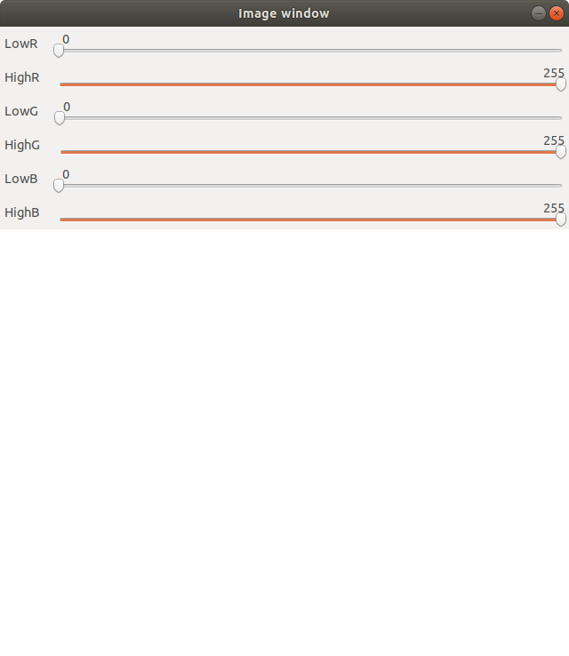
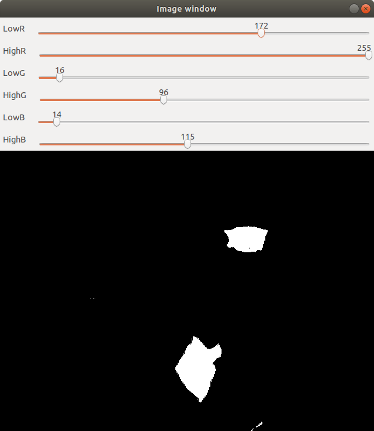
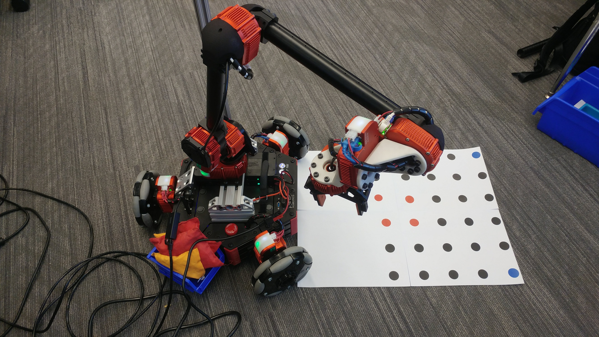
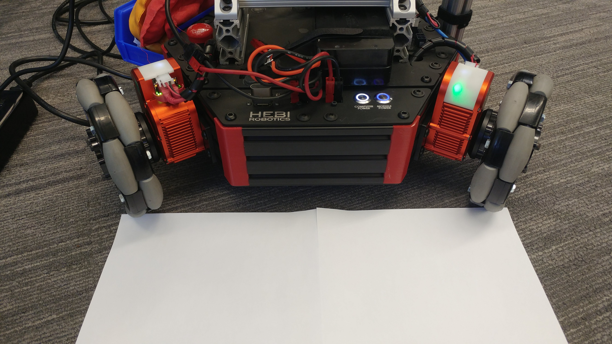
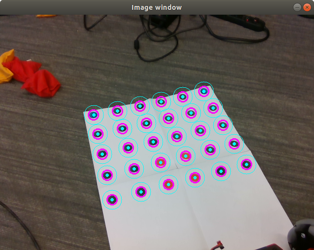
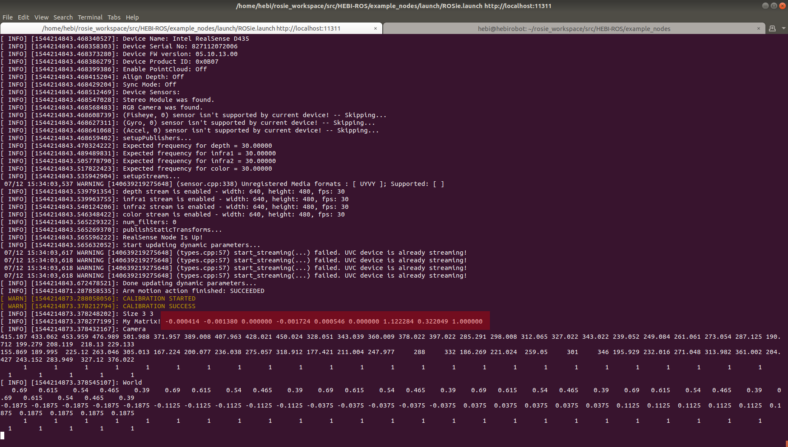

# ROSie demo

This code was run at IROS 2018 in Madrid, and is designed to be run with a HEBI Rosie robot kit, including a Intel Realsense camera mounted on a vertical pole and a basket to catch bean bags that are picked up by the robot.

# Install dependencies 

See [Install Instructions](INSTALL.md)

# Compiling

After installing the necessary Intel Realsense drivers and ROS packages, compile via `catkin_make example_nodes_generate_messages` and then `catkin_make` in your ROS workspace (~/rosie_workspace if you have followed the installation instructions above).

# Color calibration for object detection

**Color detection thresholds should be tuned for each object that is being recognized each time the lighting conditions change significantly**

You may need to tune the RGB or HSV values in order to pick up colored objects in the particular lighting conditions you run this demo in.  To do so, we have included a ROS node and launch file that allows you to drag sliders to adjust these values.  Note that you currently need to change the source to adjust to GUI to show the effect of different RGB value thresholds.

To run the GUI, run:
`roslaunch example_nodes VisionThreshold.launch`

If the realsense cannot be found, then <ctrl-C>, unplug and replug the realsense, and relaunch the program.  This will be indicated by a red text error message in the terminal.

You will see an image such as the following:



First, move the robot arm out of the image view area.  Then tune the min/max rgb values to get clear segmentation for desired objects, with as little extra noise as possible.  The object to be picked up should be displayed as white, and the background should be black.  Note that you will have to adjust the min and the max for each channel.  When complete, you should have something like the following (there are two identified bean bags in this image):



The cleaner and more robust the segmentation is, the better results you will have with the demonstration.

Once you have ranges for each of these parameters, note these values so you can add these to the color definitions, and then "ctrl-C" in the terminal to quit the thresholding GUI. Change or add the color structure for your identified object in the `src/example_nodes/src/Rosie_Demo/parameters/colors.txt` file (these parameters are loaded into the ROS parameter server when the ROSie.launch file is used).

The "rosie/enabled_colors" variable in this file determines which color definitions will be used when running the demo; for RGB color definitions define the (r/g/b)min/max variables, and for HSV color definitions, define the (h/s/v)min/max variables.

(Advanced note -- you can tweak the source of the vision process programs to allow HSV segmentation as well.)

# Starting the demo

**Important:**  Note that there is an "e-stop" button located on the base of the robot.  If anything goes wrong, press this button and the robot arm will lock into its current position; the wheels will be set to a "motor off" strategy to allow you to move the base.  If you have pressed the E-stop, you will need to restart the program to continue operation of the robot.  First stop the program, then release the E-stop, and then restart the program.

Before running, ensure that the all modules in the arm (Base, shoulder, elbow, and wrists) are within pi/2 radians of 0 (especially the base module).  To do this, open the Scope GUI, select the module, go to the "monitoring" tab, and press the "position" plot button to view the current position.  Note that the encoders are multiturn absolute, and so visually inspecting the position of the system is not sufficient!

When you start the program, the robot will move into a "home" position with the end effector in front of the robot, and if the modules are not near zero, a large motion could cause the robot arm to collide with the mast holding the realsense up.

To begin the program, launch ROSie.launch from the example_nodes package.  Note: you must be in the catkin workspace you set up for this to work (e.g., the `~/rosie_workspace` directory):

```roslaunch example_nodes ROSie.launch```

After starting the program, the robot should move to its base position.  At this time, ensure there is no red text on the screen (this indicates a problem with one of the nodes -- either the gripper, base, or arm modules cannot be found, or the computer cannot connect to the realsense).  If the modules cannot be found, <ctrl-C>, then check the connections between modules and try to restart the program.  If the realsense cannot be found, then <ctrl-C>, unplug and replug the realsense, and relaunch the program.  Note that there are a lot of information messages, and so the error message may get lost in the output quickly.  Scroll up and look for any red text.
  
Once a successful launch occurs, the program will be waiting for a Mobile IO device to appear on the robot's network.  This can be an android or iPhone, with the HEBI Mobile IO app installed.  This will be used to control the robot.

If this cannot be found, ensure that the device running the Mobile IO app is connected the the `hebi_robot` wifi network, with a password of `hebi123411`.
- If not set correctly, set the app name to "Mobile IO" and family to "HEBI".  Test from Scope on the robot to ensure the app is visible from the robot's PC.  In the iOS app, you can set this from the app settings; in Android, this is settable via Scope.
- Ensure the app is connected to the `hebi_robot` robot!

After the Mobile IO app is found, *you must press (1) on the app to begin the rest of the program!*

# Running the demo

Several buttons control the main modes of the demo:

* B1 - initialize on boot, pause while running
* B2 - continue autonomous mode
* B3 - calibrate
* B4 - deploy bean bags (so they can be picked up again)
* B5 - quit

**Important: camera + vision calibration should be completed before attempting autonomous mode!!!**

Camera to robot calibration should be completed each time the camera changes position/angle relative to the robot, or is added/removed from the robot (E.g., for packing).  See below for instructions.

Color detection thresholds should be tuned for each object that is being recognized each time the lighting conditions change significantly.  The current classifier is a simple image thresholding + blob detection approach; more sophisticated methods could be added if desired.  See above for instructions.

## Basic autonomous functionality

When "B2" is pressed, the robot will transition to "autonomous mode".  When in this mode, the robot will scan the area immediately around it for colored beanbags.  If it sees one it can reach, the robot grabs it and places it in its basket.  If it cannot reach, it moves towards the object.  If it cannot find an object, it will continue searching.

When it has cleaned up the entire area around it, it will "redeploy" its beanbags by tossing them on the floor, then moving to a slightly different starting point.

When in autonomous mode, the LEDs on the system can be used for visial diagnostic of the autonomous algorithm.  If the arm is picking a yellow beanbag, the LEDs on the arm will turn yellow.  If the base is moving towards a red beanbag, the LEDs on the three wheel modules will turn red.

# Camera to robot calibration

Note that there are four .svg files in their directory.  These should be printed out and taped together with the red dots in the center.  Be careful that these printouts are full scale on 8 1/2 x 11" paper.

Once the demo is paused, the complete 4-page calibration sheet should be centered on the floor at the front of the robot, with the blank space adjacent to the robot.  Carefully center the calibration sheet in the middle of the robot, and ensure the close edge of the paper is flush with the vertical front panel of the robot:




Then B3 can be pressed, at which time the screen should show the captured image of the calibration sheet, including the recognized circles:



Note that a successful calibration with have the purple circles (indicating the detected blobs) _and_ the cyan dots and circles (indicating the actual detected grid); if both of these do not show up the calibration was not a success.

Note with some combinations of realsense drivers and openCV, you may need multiple calibration attempts before one finally matches.  Also, the displayed image may not be shown on the first time.  However, the content in the terminal should state whether or not the calibration succeeded.

_If the calibration fails_, press "B1" to "pause" the control again, then press B3 to calibrate again.

If the captured image does not show up, trying 3-4 more times will usually work to help visualize the image.

**Important: Note that this calibration only applies for the current run of the robot; to set this as the default starting camera calibration, save these values in the source code at the location below, and be sure to recompile by running `catkin_make` in your workspace to have these values used next time the code is run. **  The source code linked below has comments describing how to transform this data.

https://github.com/HebiRobotics/HEBI-ROS/blob/04748b1b3a712a4fb881e365af1127304d29c19e/example_nodes/src/Rosie_Demo/demo_central.cpp#L327

The values that you need to use for this will be output to the screen (see the highlighted red box indicating where these values can be found):



# Code structure

The `demo_central.cpp` file/node provides the high-level logic for the demo (e.g., calling the vision service, telling the base to move, and telling the arm to move).

The `Rosie_arm_node.cpp` file/node provides a high-level interface for the arm hardware (e.g., taking commands for the arm to move to a cartesian point, and sending these as smooth trajectories to the hardware).  This consumes the `arm.hpp/cpp`, `arm_kinematics.hpp/cpp`, and `arm_trajectory.hpp/cpp` files/classes.

The `Rosie_base_node.cpp` file/node provides a high-level interface for the base hardware (e.g., taking commands for the base to move a certain distance, and sending these as smooth trajectories to the hardware)

The `vision_process.cpp` file/node provides basic image processing using the Realsense's RGB camera, and returns the position of identified colored blobs in the image.

The `gripper_node.cpp` file/node is the hardware interface for the robot's gripper.

The `vision_threshold.cpp` file is a separate node that provides a GUI for testing different threshold values in real time.


